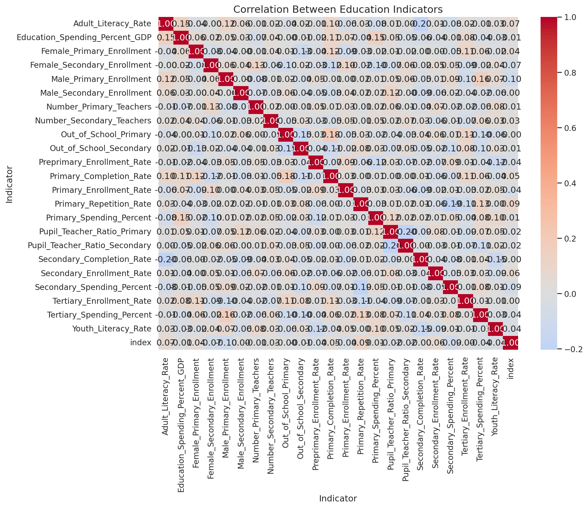
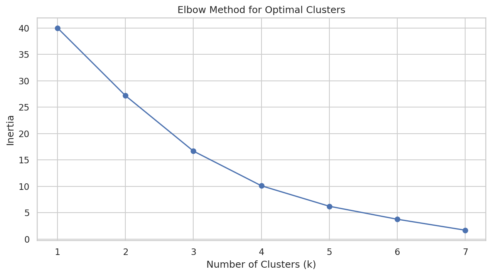

# 🌍 World Bank Global Education Analysis

An end-to-end data analysis project examining global education trends using the **World Bank API** — covering 23+ indicators across countries from **2000 to 2023**.

---

## 📌 Project Overview

This project explores how education systems differ across the world by analyzing spending, enrollment, literacy, gender equity, and teacher availability. It follows the complete data science pipeline — from raw API data to machine learning models and interactive visualizations.

---

## 🔍 Key Questions Answered

- Which countries invest the most (and least) in education?
- How have enrollment and literacy rates changed over time?
- Are there significant gender gaps in school enrollment?
- Can we cluster countries by education profile?
- What will education spending look like in the next 5 years?

---

## 📊 Indicators Tracked (23+)

| Category | Indicators |
|---|---|
| 💰 Spending | Education spending % of GDP, Primary/Secondary/Tertiary |
| 📚 Enrollment | Primary, Secondary, Tertiary, Pre-primary rates |
| ✅ Completion | Primary & Secondary completion rates |
| 📖 Literacy | Adult & Youth literacy rates |
| 👩‍🏫 Quality | Pupil-Teacher ratio, Repetition rates |
| 🏫 Out of School | Primary & Secondary |
| ⚖️ Gender | Female & Male enrollment (Primary & Secondary) |

---

## 🛠️ Tech Stack

| Tool | Purpose |
|---|---|
| `Python` | Core language |
| `Pandas / NumPy` | Data manipulation |
| `wbdata` | World Bank API |
| `SQLite` | Data storage |
| `Matplotlib / Seaborn` | Static visualizations |
| `Plotly` | Interactive charts & maps |
| `Scikit-learn` | K-Means clustering, Linear Regression |
| `Statsmodels` | Time series forecasting |
| `SciPy` | Statistical hypothesis testing |

---

## 🗂️ Project Structure

```
worldbankproject.ipynb       ← Main notebook (all 12 sections)
cleaned_education_data.csv   ← Processed dataset
world_bank_education.db      ← SQLite database
country_clusters.csv         ← K-Means clustering results
summary_statistics.csv       ← Per-indicator statistics
kpi_dashboard.csv            ← KPI summary table
education_spending_map.html  ← Interactive choropleth map
education_trends.html        ← Interactive time series
correlation_heatmap.png      ← Correlation matrix
elbow_curve.png              ← Optimal cluster selection
final_report.txt             ← Executive summary report
```

---

## 📁 Notebook Sections

1. **Install & Import Libraries**
2. **Data Collection** — World Bank API (23 indicators, all countries)
3. **Data Cleaning & Preparation** — reshape, filter, handle missing values
4. **SQL Storage** — SQLite database with query demonstrations
5. **Exploratory Data Analysis** — Top/bottom countries, year-over-year changes
6. **Statistical Analysis** — Correlation matrix, ANOVA, T-tests
7. **Country Clustering** — K-Means with elbow method (k=4 clusters)
8. **Time Series Forecasting** — Linear regression + Exponential Smoothing
9. **Interactive Visualizations** — Plotly choropleth map, trend lines
10. **Business Insights & Recommendations**
11. **Save All Results**
12. **Final Executive Report**

---

## 📈 Key Findings

- 🌍 Global average education spending: ~4% of GDP, with developed nations spending 2.5× more than developing ones
- 📚 Primary enrollment is near universal in high-income countries but remains below 70% in some regions
- 📖 Around 15% of adults globally still lack basic literacy
- 👩‍🏫 Average pupil-teacher ratio of ~30:1 indicates significant overcrowding in lower-income regions
- ⚖️ Gender enrollment gaps exceeding 10% persist in several regions

---

## 💡 Recommendations

| Priority | Recommendation |
|---|---|
| 🔴 HIGH | Increase education funding to minimum 5% of GDP for low-spending nations |
| 🔴 HIGH | Reduce pupil-teacher ratio to below 30:1 by 2030 |
| 🟡 MEDIUM | Target gender parity programs where enrollment gaps exceed 10% |
| 🟡 MEDIUM | Implement technology-based learning to boost completion rates |

---

## ⚙️ How to Run

1. Open the notebook in **Google Colab** (recommended)
2. Upload the required CSV files when prompted, or let the notebook fetch data from the World Bank API directly
3. Run all cells top to bottom

**Install dependencies:**
```bash
pip install wbdata plotly statsmodels scikit-learn pandas numpy matplotlib seaborn scipy
```

---

## 📦 Output Files Generated

After running the notebook, the following files are saved:

- `cleaned_education_data.csv`
- `world_bank_education.db`
- `correlation_heatmap.png`
- `elbow_curve.png`
- `country_clusters.csv`
- `education_spending_map.html`
- `education_trends.html`
- `summary_statistics.csv`
- `kpi_dashboard.csv`
- `final_report.txt`

## 📊 Analysis Outputs

### Static Visualizations
| Correlation Analysis | Clustering Optimization |
|---------------------|------------------------|
|  |  |

## 📊 Interactive Dashboards

### Education Trends Dashboard
[Click to view live](https://htmlpreview.github.io/?https://github.com/swastiparashar522861-max/world-bank-education-analysis/blob/main/output/education_trends.html)

### Education Spending Map  
[Click to view live](https://htmlpreview.github.io/?https://github.com/swastiparashar522861-max/world-bank-education-analysis/blob/main/output/education_spending_map.html)
**📌 Instructions:** 
- HTML files will open in your browser
- If GitHub blocks preview, download and open locally
- Hover over charts for tooltips and zoom options

👤 Author
Swasti Parashar |@swastiparashar522861-max| www.linkedin.com/in/swasti-parashar-178a4a3b8


## 📄 License

This project is for educational and portfolio purposes. Data sourced from the [World Bank Open Data](https://data.worldbank.org/).
